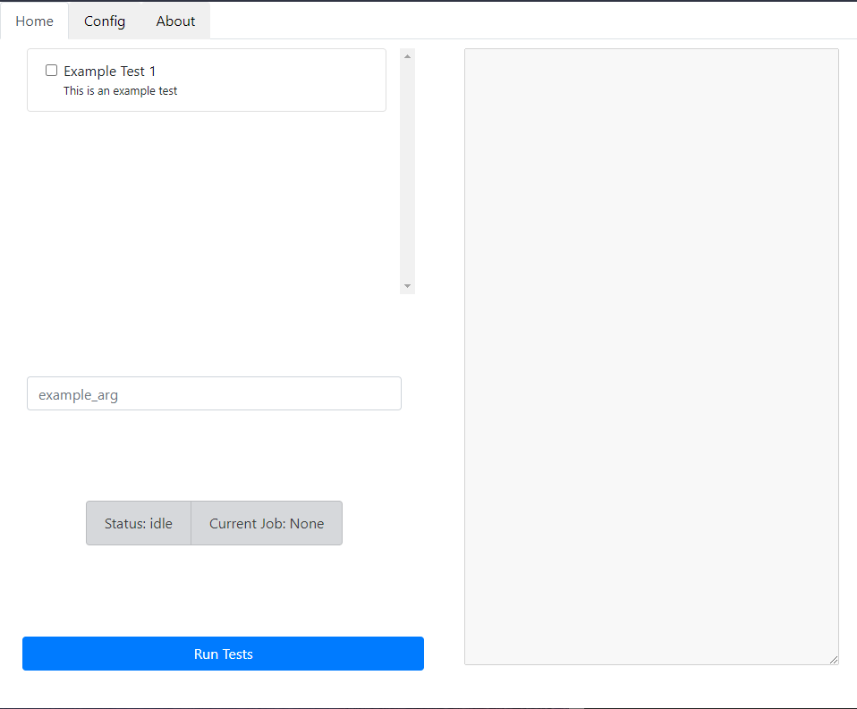
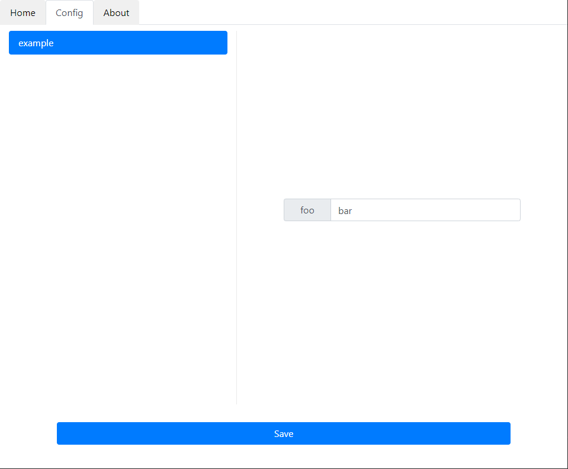

# GUIfy


---

Simplest form of GUI for automation scripts.

Made with eel as python backend and react used as frontend.

## What it's for?

Basically for automations,

If you have a couple of scripts that you want to run in a certain order, and you don't want to deal with the command line

## Main Tab


This is where you enter the arguments for the functions you wrote,

You select which functions you want to run,

And you click Run Tests to to run the functions.

---

## Config Tab



The config tab is a representation of config.ini in CWD (Current Working Directory)

it can be accessed via the main object, more info [here](#how-to-use)

---

# How to use

## Installation

```bash
pip install guify
```

Now after installing, lets import guify in main.py, and declare our app variable.

```py
# main.py
import guify

app = GUIfy()
```

Now, lets register our functions:

```py
import guify

app = GUIfy()

@app.register(priority=0) # priority is optional, 0 will run before 1
def some_test(name):
    print("Prompting user")
    app.prompt_user('HI!', f"Hello {name}!")
    print(f"Hello {name}")
```

When finished registering all functions, you add app.run() to run the mainloop of the app and show the gui.

```py
import guify

app = GUIfy()

@app.register(priority=0) # priority is optional, 0 will run before 1
def some_test(name):
    print("Prompting user")
    app.prompt_user('HI!', f"Hello {name}!")
    print(f"Hello {name}")

app.run()
```

```py
# main.py
import GUIfy from guify

# Instantiate the app, variables are optional.
# - app_name is the title of the app shown on the top, equivalent to <title /> tag in HTML
# - report_dir is the directory where reports will be stored if none reports are disabled.
# - report_prefix // the name of the variable to take the prefix from, default is "report_*.txt"
# - redirect_stdout // if True, will redirect stdout to the monitor, default is True
app = GUIfy(app_name='GUIfy', port=8080, report_dir=None, report_prefix=None, redirect_stdout=True) # default app_name is 'GUIfy'

# Register the function "test_1"
# All variables are optional
# name - the name of the "test" in the gui
# priority - Sets the order of the tests, priority 0 will run before priority 1
# description - the small text description under the test's name in the gui.
@app.register(name='Test 1', priority=0, description='This is a test')
# Define the test, each argument that "test_1"
# requires will be automatically prompted for in the gui.
# no arg will be requested twice.
def test_1(example_arg):
    # app.monitor object represents the textarea on the right-hand side of the gui
    # app.monitor.flush() - sets the text to empty string
    app.monitor.flush()

    # app.monitor.set_text(text) - sets the text to whatever is passed to it
    app.monitor.write('This is a test\n')

    # print function will also print to the monitor
    print('This is a test2\n')

    # app.prompt_user(title, prompt) - pops up a modal in the gui and asks user to click OK or cancel.
    # app.prompt_user will return True if user clicked OK and False if user clicked cancel
    result = app.prompt_user('This is the title', 'This is a prompt') # result = True if user clicked OK, False if user clicked Cancel

    # app.config get something from config tab, acts similar to configparser
    # config stored in config.ini in the current working directory.
    foo = app.config.get('example','foo') # == bar

    # Specify the return type, this is used for report generation
    # if function returns True then test considered as Passed
    # if function returns False then test considered as Failed
    return True


# this test will be registered after test_1, because its priority arg is higher.
@app.register(name='Test 2', priority=1, description='This is the second test.')
def test_2(example_arg, second_arg):
    app.monitor.flush()


app.run()

```

---

### Monitor object

app.monitor is the monitor object representing the preview window on right hand side of the GUI,

- set_text(text: str) -> None // will set the text in the monitor to whatever passed in "text" argument
- write(text: str) -> None // will append the next to the monitor, print() also works
- flush(text: str) -> None // will clear all text in the monitor

---

## Config tab

"app.config" is an object representing the config tab.
All configurations are stored in config.ini.

### app.config methods:

- get(section: str, key: str) -> str // get a value of a key in section
- get_section(section: str) -> dict\[key: str, value: str\] // get entire section as a dict
- get_all_sections() -> list\[str\] // get a list of all section names
- get_all() -> dict\[str, dict\[str, str\]\] // get all conifugartions
- insert(section: str, key:str, value: str) // insert new row in database
- update_value(section: str, key: str, value: str) // update a value of given key
- update_key(section: str, key: str, new_key: str) // update a key in said section
- delete(section: str, key: str) // delete row where section = section and key = key
- delete_section(section: str) -> tuple\[bool, str\] // delete section, returns tuple of (success, msg)

Assuming this is the config file:

```ini
[example]
foo = bar
```

This will be the correct usage of app.config object

```py
app.config.get_section('example') -> {'foo': 'bar'}
app.config.get('example', 'foo') -> 'bar'
```

---

## Building

Theoretically its possible to build an executable with eel using the following:

```bash
py -m eel index.py build --onefile --noconsole --name <whatever_u_want> --icon=public/favicon.ico
```

Please note that eel build hasn't been tested yet.
